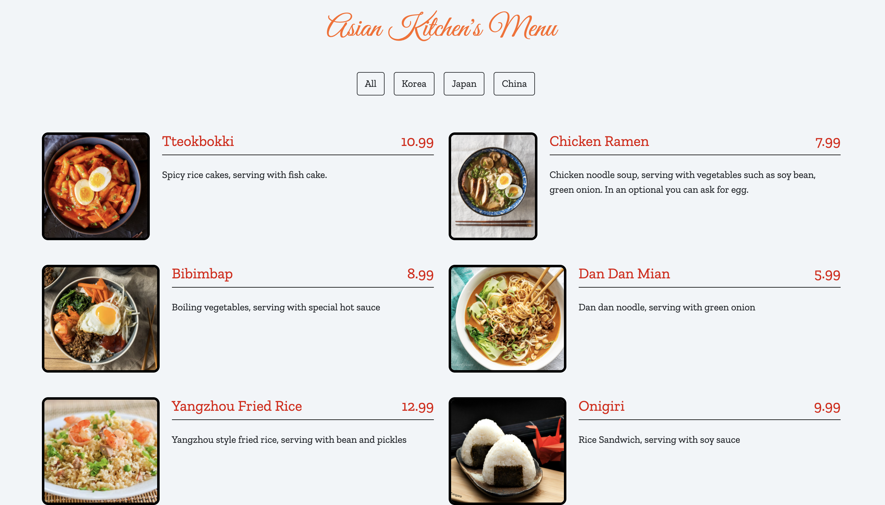

# AsianKitchensMenu
Patika.dev is a food site where I complete the JS codes for the front-end.
You can clone this project.

`````
git clone https://github.com/beeyzaozer/AsianKitchensMenu.git

`````
## What to do in the project

------------

The site is arranged in the form of a menu of a far eastern restaurant, and it is possible to navigate between pages thanks to JavaScript. We will give you the HTML and CSS codes of this site, which has a very nice appearance. We want you to complete the JavaScript part. Asian Kitchen's Menu to examine the site in detail

+ Content on the site will be defined in JavaScript as objects in a menu-shaped array.
+ There will be id, title, category, price, img and desc sections.
+ You can change the content as you wish, but be extra careful with the category names when changing them.
+ The buttons will also come from the js file.
+ You will need to use methods such as map and reduce within the site. If you don't remember, you can return to the video #38, Creating a  New List by Changing the Structure in an Array with Map.

